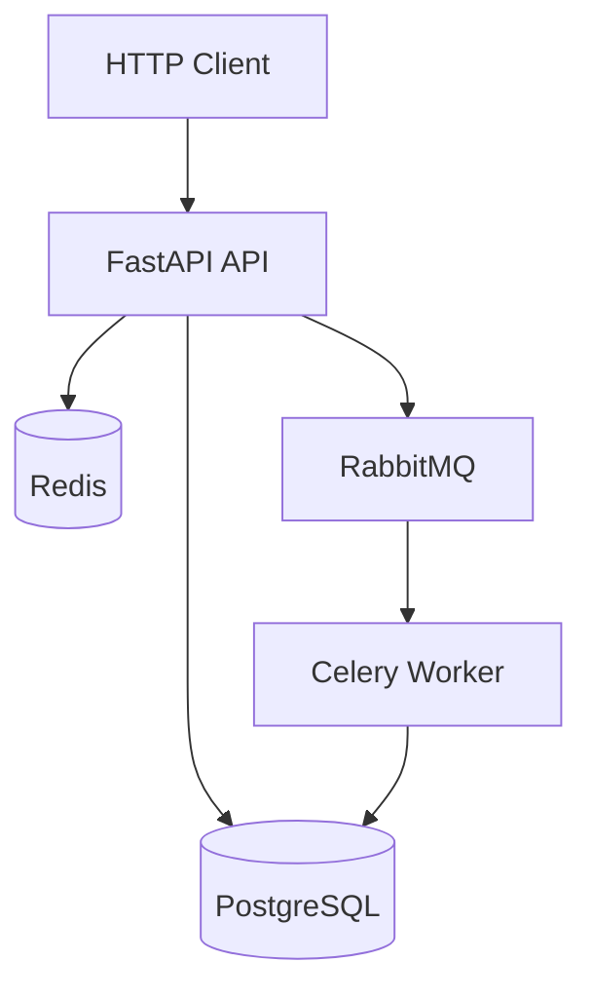

# Instituto Digital API

Management system for Digital Institute — courses, enrollments, certificates, and full operations.

## Stack

- **API:** Python 3.12 + FastAPI + Uvicorn
- **Database:** PostgreSQL 16 + SQLAlchemy 2 + Alembic
- **Queue:** Celery + RabbitMQ
- **Cache:** Redis
- **Infra:** Docker + Docker Compose

## Running locally

### Prerequisites

- Docker Desktop installed and running
- Python 3.12
- WSL 2 (if on Windows)

### Step by step

```bash
# 1. Clone the repository
git clone https://github.com/Vinicius-Leon/digital-institute.git
cd digital-institute

# 2. Copy the environment variables file
cp .env.example .env
# Edit .env if needed

# 3. Create and activate the virtual environment
python -m venv .venv
source .venv/bin/activate  # Linux/Mac/WSL

# 4. Install dependencies
pip install pip-tools
pip-sync requirements/dev.txt
pip install -e .

# 5. Start infrastructure services
docker compose up -d

# 6. Apply migrations
alembic upgrade head

# 7. Access
# API:         http://localhost:8000
# Docs:        http://localhost:8000/docs
# RabbitMQ UI: http://localhost:15672 (guest/guest)
```

## Architecture



## Running tests

```bash
# Create test database (first time only)
docker compose exec postgres psql -U institute -d institute_db \
  -c "CREATE DATABASE institute_test;"

# Unit tests
pytest tests/unit/ -v -m unit

# Integration tests
pytest tests/integration/ -v -m integration

# All tests with coverage
pytest --cov=src --cov-report=term-missing
```

## Documentation

- [Architecture](docs/02-architecture/)
- [ADRs — architecture decision records](docs/02-architecture/decisions/)
- [Contributing](CONTRIBUTING.md)
- [Security](SECURITY.md)